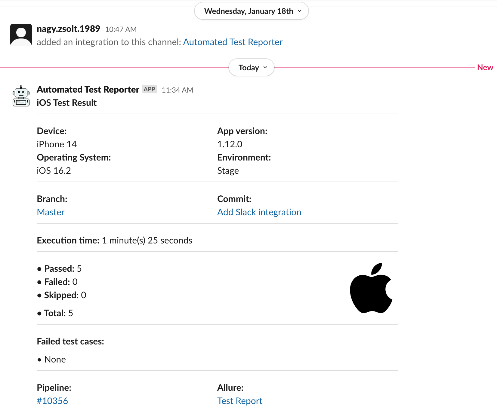

<div align="center">


# Python Mobile Automation Framework

  
  
  
  


[Overview](#scroll-overview)
•
[Framework Stack](#factory-framework-stack)
•
[Documentation](#blue_book-documentation)
•
[Demo](#dvd-demo)

</div>

## :bookmark_tabs: Menu

- [Overview](#scroll-overview)
  - [Framework Stack](#factory-framework-stack)
  - [Features](#books-features)
- [Documentation](#blue_book-documentation)
  - [Prerequisites](#exclamation-prerequisites)
  - [Design Patterns](#rice_scene-design-patterns)
  - [Directory Tree](#open_file_folder-directory-tree)
  - [Dependencies and libs](#floppy_disk-dependencies)
- [Demo](#dvd-demo)

## :scroll: Overview

A python mobile test framework for Android and iOS utilizing Appium, Selenium, Pytest and the latest tech available in January 2023.
## :factory: Framework Stack


## :books: Features

- Utilizing Page Object Model 
- Integrated Allure reporting 
- Attach screenshots to Allure before every click or input field change
- Attach a screenshot to Allure on test failure
- Capability to post the test results to Slack
- Capability to post the test results to TestRail
- Capability to retry failed cases
- Customizable console and file logger

# :blue_book: Documentation

## :exclamation: Prerequisites

- Python 3
- Pycharm
- PIP
- Appium 2
- Selenium 4
- Android Emulator 
- iOS Simulator

## :rice_scene: Design Patterns

[Page Object Model:](https://www.selenium.dev/documentation/test_practices/encouraged/page_object_models/) A structure where every page of the 
application is represented with a class that contains the elements for that page with the methods 
for interacting with these elements. When the UI of the app changes the tests themselves don’t need to change,
only the page object class should be updated. The advantages of POM:
- Easier code maintenance
- Code reusability
- Improved readability and reliability

## :floppy_disk: Dependencies

- Appium-Python-Client
- selenium
- pytest
- pytest-parallel
- pytest-xdist
- pytest-rerunfailures
- pytest-html
- pytest-metadata
- requests
- allure-pytest
- python-dotenv
- pytest-testrail

## :open_file_folder: Directory Tree
```
/Users/zsnagy/Repos/MobileTestFramework
├── apps
│   ├── demoApp.apk
│   └── demoApp.zip
├── framework
│   ├── __init__.py
│   └── core
│       ├── __init__.py
│       ├── page_base.py
│       └── test_base.py
├── pages
│   ├── __init__.py
│   ├── android
│   │   ├── __init__.py
│   │   ├── page_home.py
│   │   ├── page_sign_in.py
│   │   └── page_validation.py
│   └── ios
│       ├── __init__.py
│       ├── page_home.py
│       ├── page_sign_in.py
│       └── page_validation.py
├── tests
│   ├── __init__.py
│   ├── android
│   │   ├── __init__.py
│   │   ├── test_home.py
│   │   ├── test_sign_in.py
│   │   └── test_validation.py
│   └── ios
│       ├── __init__.py
│       ├── test_home.py
│       ├── test_sign_in.py
│       └── test_validation.py
├── utils
│   ├── __init__.py
│   ├── listeners
│   │   ├── __init__.py
│   │   └── event_listener.py
│   └── slack
│       ├── __init__.py
│       └── slack_notification.py
├── conftest.py
├── pytest.ini
├── requirements.txt
├── README.md
└── testrail.cfg
```

## :dvd: Demo

- After the configuration is adjusted in conftest.py, a test run can be initiated from the PyCharm


- Allure report


- Slack notification


